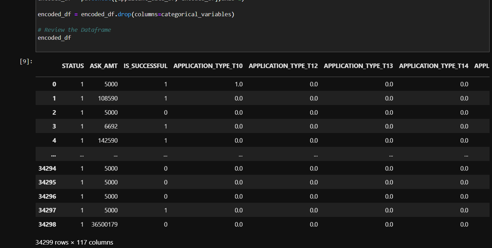
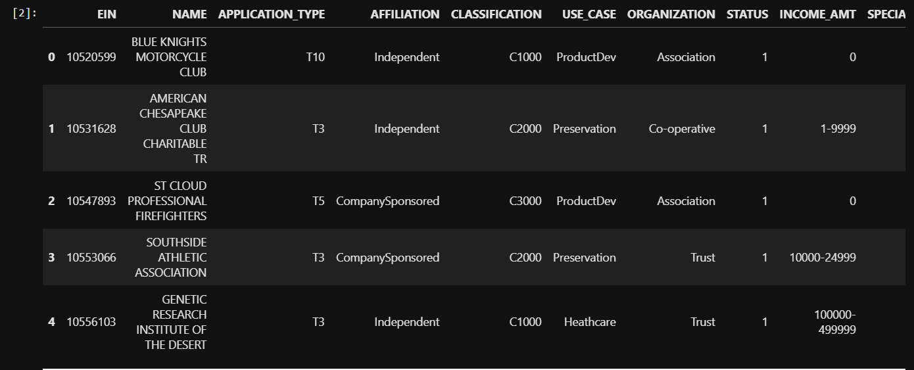
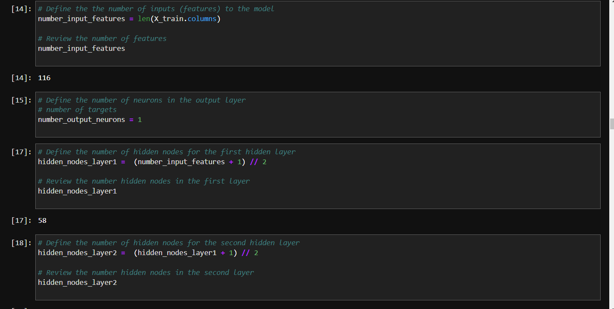
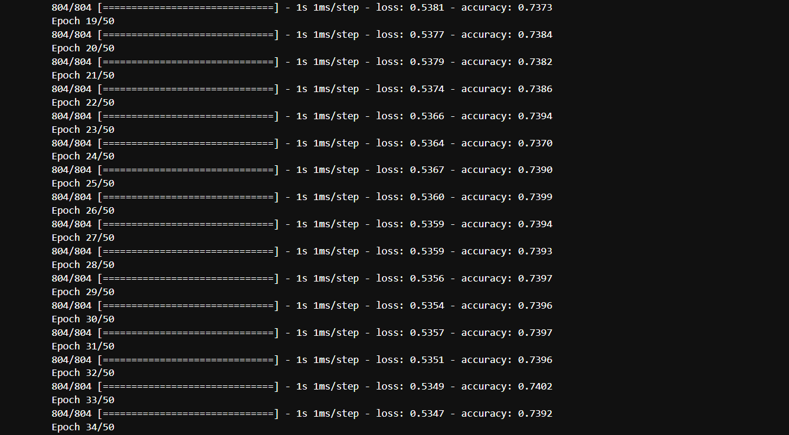

# Module_13_Challenge
# Venture Funding with Deep Learning

Hello, this project is about the Venture Funding with Deep Learning. Venture funding refers to the investment of capital into early-stage, high-potential startup companies in exchange for equity or ownership stakes. Deep learning, on the other hand, is a subfield of machine learning that focuses on using artificial neural networks with multiple layers to model and understand complex patterns and relationships in data.

---

## Technologies

pandas is a software library written for the Python programming language for data manipulation and analysis. Venture funding refers to the investment of capital by ulutilizing deep learning algorithms, venture capital firms can gain valuable insights into various aspects of startup companies, such as market potential, customer behavior, competitive landscape, and financial performance. These insights can help investors make more informed decisions, identify promising investment opportunities, and manage their portfolio more effectively. Venture funding with deep learning represents the integration of advanced machine learning techniques into the venture capital industry, aiming to enhance the investment process and drive better outcomes for both investors and startups.

## Installation Guide

Import the correct packages to begin coding.

---

## Usage

Use Plots and data frame to get the correct portfolio

---

## Contributors

-Name: John Nguyen
-Email: nguyenjohn1337@gmail.com

---

## License

Specify the details of your project’s license - that is, how others can or cannot use your code and files.
